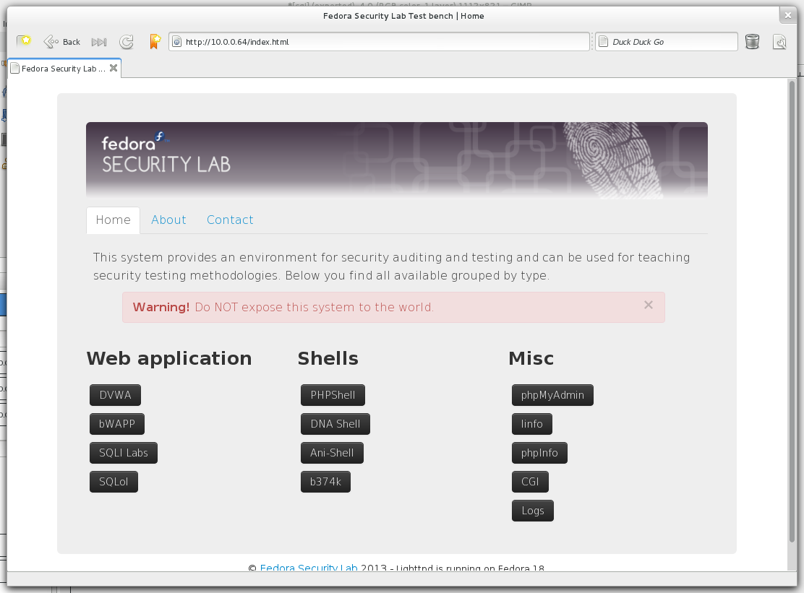

.. -*- mode: rst -*-

.. _applications-index:

.. _Fedora: https://fedoraproject.org
.. _bootstrap: http://twitter.github.io/bootstrap
.. _MySQL: https://fedoraproject.org

Applications
============

All vulnerable web application and helper tools are accessible from the
`bootstrap`_-based web interface hosted on the Test bench.

.. See :num:`figure #index-fig` on page :page:`index-fig` for the figure labeled :ref:`index-fig`.

.. _index-fig:

    
    Default start page of the web interface

The web interface is build during the setup process of the Test bench and only
available features are shown.

.. toctree::
   :maxdepth: 2

   vul-applications
   shells
   others
