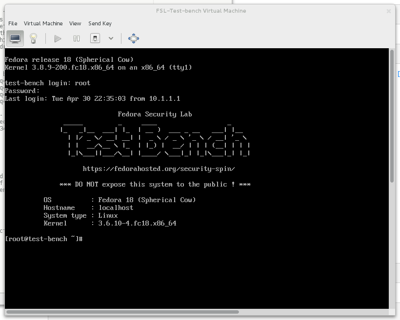
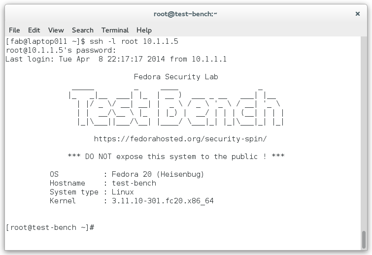

.. _Virtual Machine Manager: http://virt-manager.et.redhat.com/

.. _installation-first-steps:

First steps
===========
After the installation is done, the first step is to check if the Test bench
is responding to ping requests. This should work because the whole setup
process was relaying on a working network connection between the all involved
systems. All examples are assuming that the Test bench was created with the
default values as vm on a local machine (e.g. the vm has the IP address 
10.1.1.5). If not, adjust the IP address of your Test bench according your 
setup. ::

    $ ping -c 4 10.1.1.5
    PING 10.1.1.5 (10.1.1.5) 56(84) bytes of data.
    64 bytes from 10.1.1.5: icmp_seq=1 ttl=64 time=0.308 ms
    64 bytes from 10.1.1.5: icmp_seq=2 ttl=64 time=0.407 ms
    64 bytes from 10.1.1.5: icmp_seq=3 ttl=64 time=0.408 ms
    64 bytes from 10.1.1.5: icmp_seq=4 ttl=64 time=0.248 ms

    --- 10.1.1.5 ping statistics ---
    4 packets transmitted, 4 received, 0% packet loss, time 3000ms
    rtt min/avg/max/mdev = 0.248/0.342/0.408/0.071 ms

If you want to login directly in your virtual machine, launch
`Virtual Machine Manager`_ (``virt-manager``) and connect to the virtual
machine **FSL-Test-bench**.

.. _virt-man-fig:
.. figure:: ../images/virt-man.png
    :align: center
    
    Virtual Machine Manager

Make a right-click on the ``FSL-Test-bench`` entry and choose **Open**. Login
with username **root** and passwort **testbench**.

.. _virt-console-fig:

    
    Virtual Machine Manager console view

The fastest way is just to connect to the Test bench over ssh and login
with username **root** and passwort **testbench**.::

    $ ssh -l root 10.1.1.5

.. _terminal-fig:

    
    motd of the Test bench
