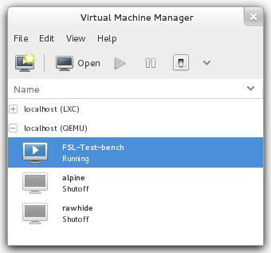

.. -*- mode: rst -*-

.. _installation-local-setup:

.. _script: https://git.fedorahosted.org/cgit/security-spin.git/plain/test-bench/fsl-tb-inst
.. _git repository: https://github.com/fabaff/fsl-test-bench
.. _Virtual Machine Manager: http://virt-manager.et.redhat.com/

Setup on a local machine
========================

The setup of the Fedora Security Lab Test bench as virtual machine on a local
system is useful if you want to carry your Test bench around on your laptop
and use it only for yourself. Another good reasons to use the Test bench as
local machine are when you don't want to expose a system like this in your
network or not want to use the Test bench on a dedicated/remote system.

At the moment there are two way available to deploy a Fedora Security Lab
Test bench from scratch. One way is to use a simple bash script which is a
collection of all needed steps. With the script the Test bench is setup 
without any user intervention and runs with the default values.  

If you want to customize your Test bench the manual way is the right one to go. 

Requirement
-----------

The requirements for running a Test bench on your local system are minimal.

* Fedora system which is capable to run a hypervisor (qemu/kvm)
* a working connection to the internet
* root access to the host
* disk space (at least 8 GB)

It may work on other distribution but this is not tested.

Automatic setup
---------------

For a fast setup of a local Test bench, just download the ``fsl-tb-inst``
`script`_.

Get the script with curl. ::

    $ curl https://git.fedorahosted.org/cgit/security-spin.git/plain/test-bench/fsl-tb-inst -o fsl-tb-inst

Set the execute permission as root. ::

    # chmod +x fsl-tb-inst

Run the script as root. ::

    # ./fsl-tb-inst

Depending on your hardware setup and the speed of your internet connection it
takes some time to finish [#f1]_. If you want to see what's going on, connect
to the virtual machine **FSL-Test-bench** with `Virtual Machine Manager`_ per
example.

After the setup of the virtual machine itself you can connect to the Test
bench over ssh. ::

    $ ssh -l root 10.1.1.5

Check the logs to see what's happening. ::

    # journalctl -f

Manual setup
------------
If you want to have more control over the creation process, adding other
settings, changing the configuration, or just not want to use the default 
values, the manual setup gives you that fexibility.

Create the file ``/etc/ansible/hosts`` with the following content. ::

    [localhost]
    127.0.0.1

Install the needed packages::

    $ sudo yum -y install git ansible

Clone the FSL Test bench `git repository`_. ::

    $ git clone git://github.com/fabaff/fsl-test-bench.git

The file ``variables/local.yml`` contains variables for the virtual machine
and the used virtal network. Modify the variables as you need.
Especially when you detect a collision of the IP range with your local setup.
If you have a host system with a lot of memory, increasing the amount of RAM
assigned to the virtual machine is a good idea.

In the file ``fsl-test-bench/all-in-one.yml`` are all features listed. Comment-
out unwanted playbook. Most playbook for services are independent but the 
ordering is relevant for tasks which modify the web interface. If the web 
server is not present, it doesn't make sense to add a page to the web interface. 

All sensitive variables (password and certificate elements) are stored in the 
file ``fsl-test-bench/variables/sensitive.yml``. Change the data in this file. 

Run the playbooks. The first one setup your local machine with the needed
elements (libvirt) and create the virtual maschine. The second is setting up 
the Test bench. ::

    $ sudo ansible-playbook fsl-test-bench/local-setup.yml --connection=local
    $ sudo ansible-playbook fsl-test-bench/all-in-one.yml

Now wait...If your are connected to your local machine then you can abort the
task with ``Ctrl+c c`` when the virtual machine is ready. There are two wait
cycles included, one for the vm setup and one for the launch of the vm.

Use ``virsh`` to check if the process is finished. ::

    $ sudo virsh list --all
     Id    Name                           State
    ----------------------------------------------------
     1     FSL-Test-bench                 running
     -     alpine                         shut off
     -     rawhide                        shut off

If the vm is running, you can connect to the Test bench over ssh. ::

    $ ssh -l root 10.1.1.5

Check the logs to see what's happening. ::

    # journalctl -f

.. rubric:: Footnotes

.. [#f1] On a host system with an Intel(R) Core(TM)2 Quad CPU Q6600 @ 2.40 GHz 
         CPU, 8 GB of memory, and Fedora 20 connected with a 35 Mbit/s line
         it take around 30 minutes to complete all tasks.
