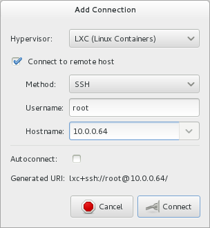
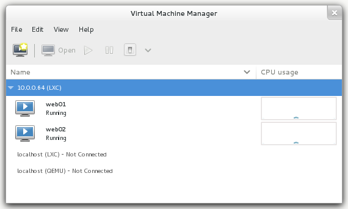

.. -*- mode: rst -*-

.. _machines-containers:

.. _LXC: http://lxc.sourceforge.net/
.. _Virtual Machine Manager: http://virt-manager.et.redhat.com/
.. _libvirt: http://libvirt.org
.. _virsh command reference: http://libvirt.org/virshcmdref.html

Containers
==========
The high-interaction "honeypots" are running as `LXC`_ (Linux containers).  
LXC provides system-level virtualization which has its own processes and own
network space. This means that the containers are able to run linux systems 
in a isolated and virtual environment. The containers are separated from the
Fedora Security Lab Test Bench and are using `libvirt`_ for the network.

Network
-------
The containers are placed in a separated network which is running in **route**
mode. This way the network traffic from the containers can pass back and forth
without using NAT. The downside is that additional configuration on the clients
is needed. 

- Network mode: Routed
- Gateway: 10.10.1.1 (MAC address: 52:52:11:11:11:11)
- Network: 10.10.1.0/255
- DHCP: on
- DHCP range: 10.10.1.50 - 10.10.1.60

To access the container network you need to add a static route the this network.
libvirt acts as virtual router on your Fedora Security Lab Test Bench and the 
hosts on the physical network do not know that there exists a subnet. ::

    $ sudo route add -net 10.10.1.0 netmask 255.255.255.0 gw [IP address of your FSL Test Bench] dev [Interface]

After adding the route, check if the containers are responding.

Available systems
-----------------

+----------------+-------------------+--------------+----------+
| Container name | MAC address       | IP address   | Details  |
+================+===================+==============+==========+
| web01          | 52:52:22:22:22:22 | 10.10.1.60   |          |
+----------------+-------------------+--------------+----------+
| web02          | 52:52:33:33:33:33 | 10.10.1.61   |          |
+----------------+-------------------+--------------+----------+

Management
----------
The containers are launched automatically then the Fedora Security Lab Test
Bench starts. It makes sense to shut them down if you are running a system which
has only limited resources and you are working on different sections. 

There are several ways for maintaining the containers. If you have a SSH
connection to your Test Bench, you can use ``virsh``.

Show all running containers::

    # virsh --connect lxc:/// list --all

For stopping::

    # virsh --connect lxc:/// shutdown [container name]

For starting::

    # virsh --connect lxc:/// start [container name]

For more details about ``virsh`` please check the virsh man page. ::

    $ man virsh

or the `virsh command reference`_.

For managing the containers in a GUI way launch `Virtual Machine Manager`_
(``virt-manager``). The first step is to connect to your Fedora Security Lab
Test Bench. Goto **File** and choose **Add connection...** after
`Virtual Machine Manager`_ was started. Choose **LXC (Linux Containers)**
as Hypervisor, **SSH** as Method, **root** as Username is ok, and enter the
IP address of Fedora Security Lab Test Bench.

.. _virt-man-lxc1-fig:

    
    Add connection in Virtual Machine Manager

All containers can now be manipulated (shutdown, reboot, etc.) like virtual 
machine hosted on your local system if you have any. 

.. _virt-man-lxc2-fig:

    
    LX containers in Virtual Machine Manager

`Virtual Machine Manager`_ will present you a login shell after you have open
a container.

.. _virt-man-lxc3-fig:
.. figure:: ../images/virt-man-lxc3.png
    :align: center
    
    Shell of the ``web01`` container in `Virtual Machine Manager`_
