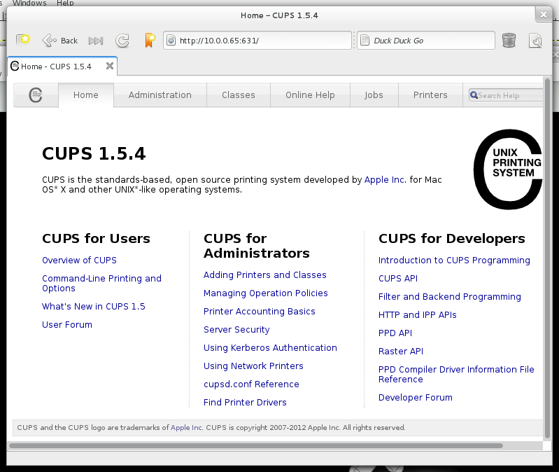

.. -*- mode: rst -*-

.. _services-misc-cups:

.. _cups: http://www.cups.org

cups
====

`cups`_ is a standards-based printing system and uses the Internet Printing
Protocol (IPP) to support printing to local and network printers. The web 
interface accessible at http://10.0.0.65:631/ 

.. _cups-fig:

    
    CUPS web interface
