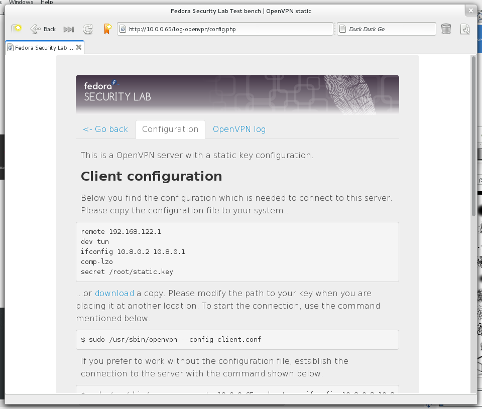

.. -*- mode: rst -*-

.. _services-misc-openvpn:

.. _OpenVPN: http://openvpn.net

OpenVPN
=======

`OpenVPN`_ is an software application which makes virtual private network
(VPN) techniques available for creating secure point-to-point or site-to-site
connections over unsecure networks like the internet. OpenVPN is capable of
traversing firewall and common SOHO router with network address translators
(NATs).

Peers are allowed to authenticate each other using certificates, a pre-shared
secret key, or username/password. The FSL Test Bench only provides an OpenVPN
server with a static key configuration.

.. _openvpn-fig:

    
    Configuration page for OpenVPN 
