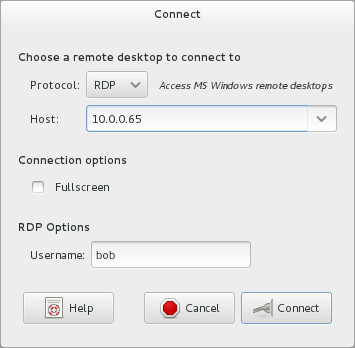
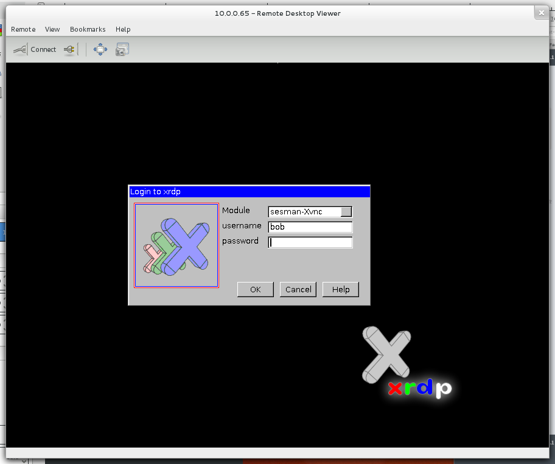

.. -*- mode: rst -*-

.. _services-misc-xrdp:

.. _xrdp: http://www.xrdp.org/
.. _Vinagre: https://projects.gnome.org/vinagre/

xrdp
====

`xrdp`_ is an remote desktop protocol (RDP) server. To connect to the FSL Test
Bench use `Vinagre`_ which is named usually **Remote Desktop Viewer** in 
graphical user environment (``yum -y install vinagre``) and is a client that
support various protocols (VNC, ssh, rdp, and spice) or a lient of your choice.

.. _rdp-config-fig:

    
    Remote Desktop Viewer configuration

.. _vinagre-fig:

    
    Remote Desktop Viewer configuration
