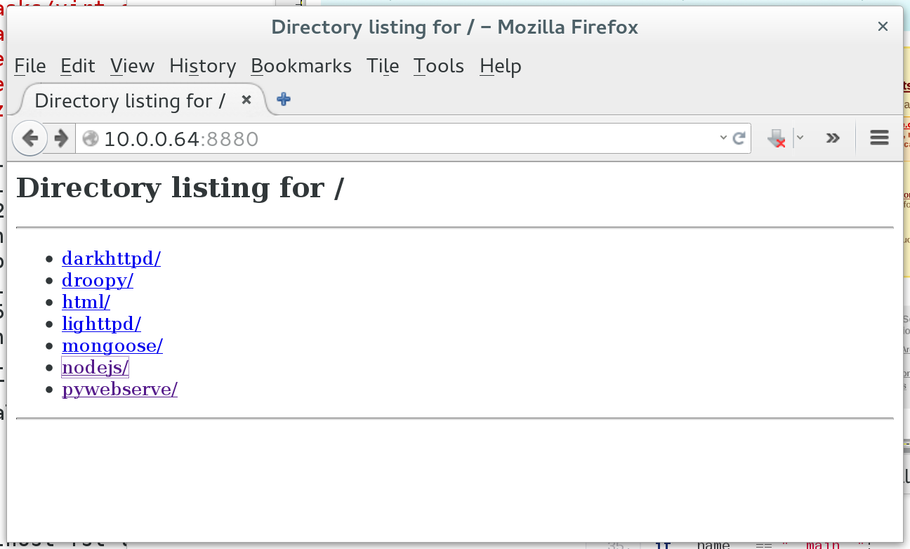

.. _services-webserver-pywebserve:

.. _pywebserve: http://gitorious.org/pywebserve

pywebserve
==========
`pywebserve`_ aims to expose a local directory to the world. It is using only
Python modules (BaseHTTPServer and SimpleHTTPServer) and can be controlled by
systemd.

The server is listening on port 8880.

.. _pywebserve-fig:

    
    pywebserve

This example shows the details of the `pywebserve`_ web server. ::

    $ nc 10.0.0.64 8880
    HEAD / HTTP/1.1
    host: localhost

    HTTP/1.0 200 OK
    Server: SimpleHTTP/0.6 Python/2.7.5
    Date: Sat, 01 Nov 2014 13:12:15 GMT
    Content-type: text/html; charset=UTF-8
    Content-Length: 434
